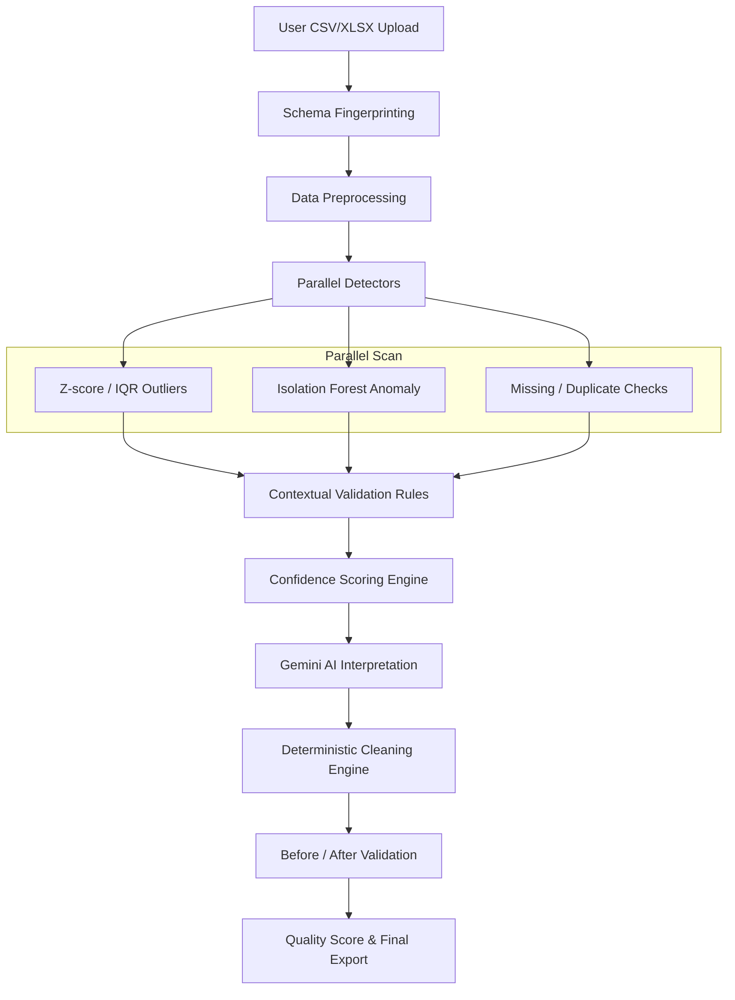

# DataSetIQ - AI-Assisted, Context-Aware Data Quality Platform

DataSetIQ is a full-stack data quality analysis and cleaning platform. It merges statistical outlier detection (Z-score/IQR) and machine-learning models (Isolation Forest) with contextual validation rules. Gemini acts as an interpretation layer to generate cause/impact hypotheses and recommend cleaning actions, which are executed deterministically.

## Core Principle
**"The LLM proposes and explains. The deterministic Python layer decides and executes."**
No code path allows Gemini's output to directly modify datasets. Every action must be chosen from a constrained menu of corrections: `impute`, `drop`, `cap`, `correct_formula`, `normalize_format`, `flag_for_review`, or `keep_no_action`.

---

## System Architecture & Flow



---

## Technology Stack

- **Frontend:** React, Vite, Tailwind CSS, Lucide Icons, Plotly (via CDN)
- **Backend:** FastAPI, Uvicorn, Pydantic (Settings & Schemas), SQLite, SQLAlchemy
- **Statistics & ML:** Pandas, NumPy, SciPy (Z-score/IQR), scikit-learn (Isolation Forest)
- **Validation Utilities:** `email-validator`
- **AI Integration:** Google Gemini API (model `gemini-2.5-flash` or `gemini-1.5-flash`)

---

## Worked Example Walkthrough (Shopify Order Export)

The repository includes a sample order export with specific issues designed to prove DataSetIQ's context-aware capabilities:

1. **Row 1005: Legitimate Outlier ($999)**
   - *Issue:* High transaction amount triggers statistical & ML flags.
   - *Context:* Passes arithmetic check (`quantity * price = total`).
   - *Scoring:* Combined confidence = **0.20 (Low)**.
   - *Result:* Kept untouched (labeled "reviewed - legitimate").
2. **Row 1008: Decimal entry error ($180)**
   - *Issue:* Total listed as $180, expected $18 (qty = 1, price = 18).
   - *Context:* Fails arithmetic check.
   - *Scoring:* Floored to **0.90 (High)**.
   - *Result:* Auto-corrected to $18.00 via `correct_formula`.
3. **Row 1004: Duplicate negative quantity**
   - *Issue:* Quantity = -1. Duplicate record.
   - *Scoring:* Combined confidence = **0.98 (High)**.
   - *Result:* Duplicate dropped; negative quantity row flagged.
4. **Row 1003: Missing customer email**
   - *Issue:* Required contact email is null.
   - *Scoring:* Combined confidence = **0.95 (High)**.
   - *Result:* Left blank and flagged for manual analyst follow-up.

---

## Getting Started

### Prerequisites
- Python 3.10+
- Node.js 18+

### 1. Local Development Setup

#### Backend Setup
1. Navigate to the `backend/` directory:
   ```bash
   cd backend
   ```
2. Create and activate a virtual environment:
   ```bash
   python -m venv venv
   source venv/bin/activate  # On Windows: venv\Scripts\activate
   ```
3. Install dependencies:
   ```bash
   pip install -r requirements.txt
   ```
4. Configure `.env`:
   Copy `.env.example` to `.env`. Fill in `GEMINI_API_KEY` with your Google Gemini API key. If left blank, the app will run in **degraded mode** using built-in mock interpretations.
5. Start FastAPI:
   ```bash
   uvicorn app.main:app --reload --port 8000
   ```

#### Frontend Setup
1. Navigate to the `frontend/` directory:
   ```bash
   cd frontend
   ```
2. Install dependencies:
   ```bash
   npm install
   ```
3. Start Vite dev server:
   ```bash
   npm run dev
   ```
   Open `http://localhost:5173` in your browser.

---

### 2. Running via Docker Compose

Run the entire platform with a single command from the root directory:
```bash
docker-compose up --build
```
The frontend is exposed on `http://localhost`, and the backend runs on `http://localhost:8000`.

---

## Verification & Testing

To run unit and integration tests:
```bash
cd backend
pytest app/tests
```
